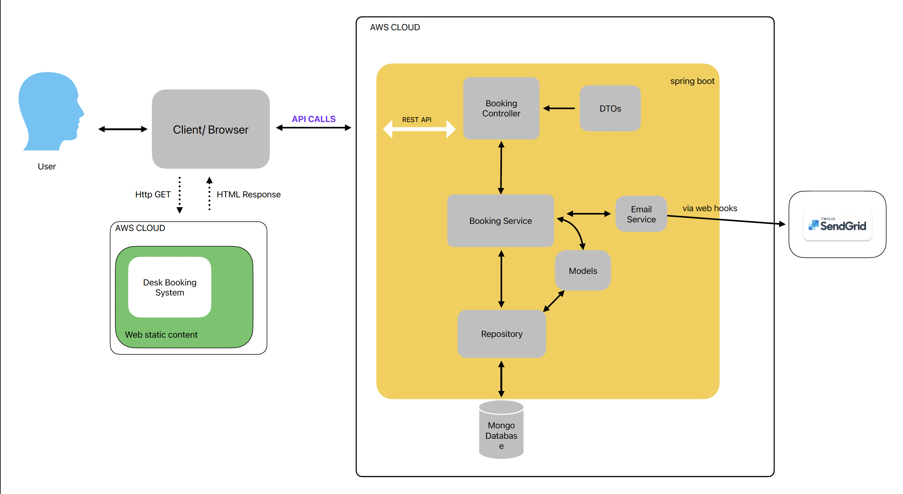

# System Name
Desk bookings

# Contributors
[Antonio Neves](https://github.com/antonioNeves3T)

[Mayank Yadav](https://github.com/matank78)

[Nikita Tsvetkov](https://github.com/nick-t-v)

[Sean Sexton](https://github.com/sean-sexton-gif)

# Use Cases: 
1. Employee books a desk.

As an employee I must be able to book a desk for a specific date and receive an email confirming the booking.
- The Employee must be able to log in using their email address and generated password.
- After logging in, the Employee must see the current day's desk bookings.
- The Employee must be able to choose a date.
- Once the date is chosen the Employee must be able to see available desks.
- The Employee must be able to select an available desk and book it.
- Then once the booking has been confirmed the Employee must receive a confirmation email with the booking details.
2. Employee views desk booking history.

As an Employee I must be able to view a history of desks that I have booked.The Employee must be able to sign in using their email address.
- After logging in the Employee must be able to see a list of all desks they have booked and the booking details (booking date/desk).
3. Employee cancels desk booking.

As an Employee I must be able to cancel a desk booking.
- The Employee must be able to log in using their email address.
- After signing in the Employee must be able to see a list of all desks they have booked and the booking details (date/desk).
- The Employee must then be able to select current and future bookings.
- The Employee must then be able to cancel that booking ~by adding their confirmation number for that booking~.
- Then once a booking has been canceled the Employee should receive a confirmation email with the cancelled bookings details.
4. Employee views current desk availability.

As an Employee I must be able to see what desks are currently available.
- The Employee must be able to log in using their email address.
- After signing in, the Employee must see the current day's desk bookings.
- The Employee must be able to choose a date/time.
- Once the date is chosen the Employee must be able to see available desks.

# External systems
1. Email sending service - [SendGrid](https://sendgrid.com/)
2. System clock - saving timestamps (e.g. booking created time)

# System Architecture Style
Frontend + Monolithic Backend

# Architecture Diagram

# Tech stack
## FE: 
Vite + Vitest, React
## BE:
Spring Boot + MongoDB

# Repository Strategy
Multi Repo approach

# Branching Strategy
Feature Branching

# Deployment Model
Deployment on AWS

# Repositories
### FE:
https://github.com/3T-Operations-Team/desk-bookings-fe.git

### BE: 
https://github.com/3T-Operations-Team/desk-bookings-be.git

### System Test:
https://github.com/3T-Operations-Team/desk-bookings-system-tests.git

# Project Boards
https://github.com/orgs/3T-Operations-Team/projects/1/views/1

# Manual Testing
https://github.com/3T-Operations-Team/desk-bookings-system/blob/master/manualTestingProcedure.txt

# Pipeline Dashboard

## Component Stages

| Component          | Commit Stage         |  Acceptance Stage     |  UAT Stage            |  Production Stage     |
| ------------------ | ----------------------- | -------------------- | ----------------------- | ----------------------- |
| **Frontend**        |  | [[ | [ | [ |
| **Backend**    | [ | [ | [ | [ |

## System Stages

|                    |  Acceptance Stage    | UAT Stage            |  Production Stage     |
| ------------------ | -------------------- | -------------------- |-----------------------|
| **System**         | [ | [ | [ |
